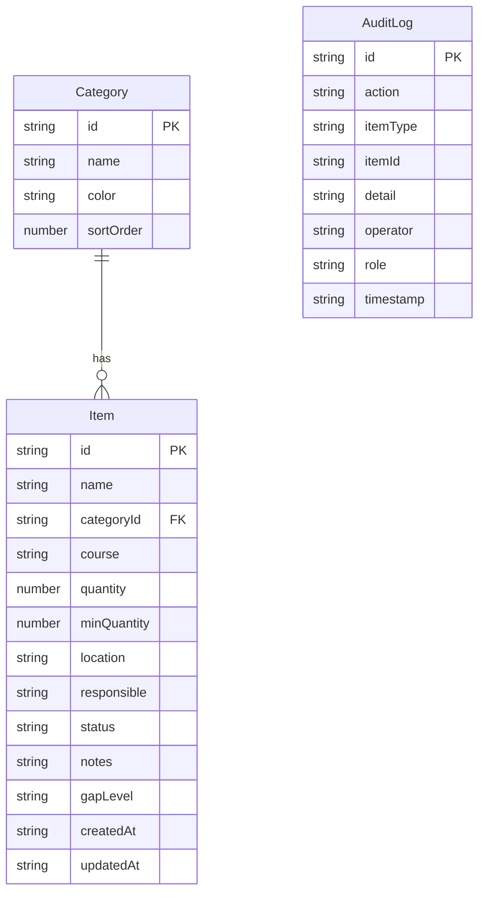

## 1. 架构设计

纯前端架构，所有数据存储在浏览器 localStorage，无后端服务。

```mermaid
graph TB
    "Vue3 应用层" --> "Composables 层"
    "Composables 层" --> "localStorage 持久化层"
    "Vue3 应用层" --> "组件层"
    "组件层" --> "物品管理页"
    "组件层" --> "分类管理弹窗"
    "组件层" --> "缺口分析面板"
    "组件层" --> "变更记录面板"
    "Composables 层" --> "useItems: 物品CRUD"
    "Composables 层" --> "useCategories: 分类管理"
    "Composables 层" --> "useAuditLog: 变更记录"
    "Composables 层" --> "useFilters: 筛选逻辑"
    "Composables 层" --> "useCheckMode: 课前核对"
    "Composables 层" --> "useAutoCheck: 自动检查"
    "Composables 层" --> "useExport: 导出功能"
    "Composables 层" --> "useRole: 角色权限"
```

## 2. 技术说明

- **前端框架**：Vue 3 + TypeScript + Composition API (`<script setup lang="ts">`)
- **构建工具**：Vite
- **样式方案**：Tailwind CSS 3
- **路由**：Vue Router（单页面，仅用于可能的模式切换）
- **状态管理**：reactive + localStorage 持久化（使用自定义 composable）
- **图标库**：lucide-vue-next
- **数据存储**：浏览器 localStorage，草稿自动保存
- **初始化工具**：vite-init (vue-ts 模板)
- **后端**：无

## 3. 路由定义

| 路由 | 用途 |
|------|------|
| / | 物品管理主页面（包含所有功能面板） |

## 4. API 定义

无后端 API，所有数据操作通过 composable 函数直接读写 localStorage。

## 5. 数据模型

### 5.1 数据模型定义



### 5.2 数据定义

**Item 状态枚举**：
- `pending` - 待准备
- `ready` - 已备齐
- `supplement` - 需补充
- `suspended` - 暂停使用

**缺口等级枚举**：
- `none` - 无缺口
- `warning` - 警告（数量接近最低数量）
- `critical` - 严重（数量低于最低数量或责任人缺失）

**自动检查规则**：
1. 数量 < 最低数量 → 标记为 critical 缺口
2. 责任人为空 → 标记为 critical 缺口
3. 同名物品存在于同一课程 → 标记为 warning 重复
4. 同一课程中 critical 缺口数量 ≥ 3 → 课程级别 critical 警告

**localStorage 键**：
- `course-prep-items` - 物品列表
- `course-prep-categories` - 分类列表
- `course-prep-audit-log` - 变更记录
- `course-prep-role` - 当前角色
- `course-prep-draft` - 草稿数据
